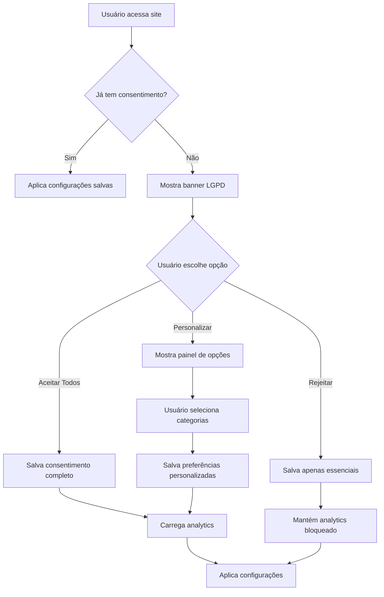

# 🍪 Sistema LGPD Premium - Cumaru Restaurante

## 📋 Visão Geral

Sistema profissional de consentimento de cookies LGPD com design premium que se integra perfeitamente à identidade visual sofisticada do restaurante Cumaru.

## ✅ Características Implementadas

### 🎨 Design Premium
- **Paleta Coerente**: Utiliza as mesmas cores do site (`#051a1a`, `#d9c1a0`, `#a52a2a`)
- **Identidade Visual**: Banner parece parte nativa do design
- **Animações Sofisticadas**: Motion elegante e discreto
- **Layout Cinematográfico**: Posição inferior com aparência high-end
- **Tipografia Consistente**: Usa as fontes "Playfair Display" e "Oswald" do site

### 🔧 Funcionalidades Completas
- **Três Opções de Consentimento**: Aceitar Todos, Personalizar, Rejeitar
- **Painel de Personalização**: Controle granular por categoria de cookies
- **Persistência**: Consentimento salvo no localStorage
- **Bloqueio Inteligente**: Analytics só carrega após consentimento
- **Feedback Visual**: Notificações temporárias de sucesso
- **Links de Política**: Para Política de Privacidade e Cookies

### ♿ Acessibilidade Total
- **Navegação por Teclado**: Suporte completo com Tab, Shift+Tab, ESC
- **Focus Trap**: Banner mantém foco dentro do componente
- **ARIA Labels**: Todos elementos com descrições apropriadas
- **Contraste Adequado**: Cores otimizadas para leitura
- **Redução de Motion**: Respeita `prefers-reduced-motion`
- **High Contrast**: Suporte para `prefers-contrast: high`

### 📱 Responsividade Perfetada
- **Desktop**: Layout em grid com espaçamento elegante
- **Tablets**: Layout em coluna única com botões maiores
- **Mobile**: Otimizado para telas pequenas com touch-friendly

## 🗂️ Estrutura de Arquivos

```
src/
├── lgpd-consent.js          # JavaScript principal do sistema
├── lgpd-banner.css          # Estilos premium do banner
└── lgpd-banner.html         # Template HTML (inserido via JS)

Páginas HTML atualizadas:
├── index.html                # ✅ Integrado
├── reservas.html             # ✅ Integrado  
├── cardapio.html             # ✅ Integrado
├── nossaraiz.html            # ✅ Integrado
├── carnes.html               # ✅ Integrado
├── petiscos.html             # ✅ Integrado
└── drinks.html                # ✅ Integrado
```

## 🎯 Como Funciona

### 1. Inicialização
```javascript
// O sistema se inicializa automaticamente quando o script é carregado
const lgpdManager = new LGPDConsentManager();
```

### 2. Verificação de Consentimento
```javascript
// Verificar se usuário já deu consentimento
if (lgpdManager.hasConsent('analytics')) {
  // Analytics permitido
} else {
  // Analytics bloqueado
}
```

### 3. Eventos Personalizados
```javascript
// Escutar mudanças de consentimento
document.addEventListener('lgpdConsentUpdated', (event) => {
  console.log('Consentimento atualizado:', event.detail.consent);
});
```

## 🎨 Paleta de Cores

```css
:root {
  --lgpd-bg-primary: #051a1a;          /* Verde escuro sofisticado */
  --lgpd-gold: #d9c1a0;               /* Dourado/bege premium */
  --lgpd-burgundy: #a52a2a;            /* Vermelho bordô */
  --lgpd-text-primary: #f5f5f5;         /* Texto claro */
  --lgpd-text-secondary: rgba(245, 245, 245, 0.7);
}
```

## 🔧 Configuração de Analytics

### Google Analytics 4
No arquivo `src/analytics.js`, substitua:
```javascript
gtag('config', 'G-SEU_MEASUREMENT_ID', {
  'anonymize_ip': true,
  'cookie_domain': 'auto',
  'cookie_flags': 'SameSite=Lax;Secure'
});
```

### Google Tag Manager
Substitua:
```javascript
})(window,document,'script','dataLayer','GTM-SEU_CONTAINER_ID');
```

### Meta Pixel
Substitua:
```javascript
fbq('init', 'SEU_PIXEL_ID');
```

## 📊 Fluxo de Consentimento



## 🎭 Comportamento do Banner

### Aparição
- **Delay**: 1.5 segundos após carregamento da página
- **Animação**: Slide suave de baixo para cima
- **Backdrop**: Blur elegante com overlay escuro

### Interação
- **Hover**: Efeitos sutis nos botões com transform e shadow
- **Active**: Feedback tátil com leve movimento
- **Focus**: Outline dourado para acessibilidade

### Fechamento
- **Aceitar/Rejeitar**: Banner some com animação suave
- **Personalizar**: Abre painel expansivo com animação slide
- **ESC**: Fecha painel de personalização

## 📱 Breakpoints Responsivos

### Desktop (>768px)
```css
.lgpd-container {
  display: grid;
  grid-template-columns: auto 1fr;
  gap: 32px;
}
```

### Tablet (≤768px)
```css
.lgpd-container {
  grid-template-columns: 1fr;
  gap: 24px;
}

.lgpd-actions {
  flex-direction: column;
}
```

### Mobile (≤480px)
```css
.lgpd-container {
  padding: 20px 16px;
}

.lgpd-btn {
  width: 100%;
  padding: 14px 20px;
}
```

## 🔒 Segurança e Privacidade

### Armazenamento
- **localStorage**: Consentimento salvo localmente
- **Expiração**: Sem expiração (permanente até limpeza)
- **Criptografia**: Dados em formato JSON simples
- **Segurança**: Sem dados sensíveis armazenados

### Bloqueio de Analytics
- **Pré-consentimento**: Scripts bloqueados completamente
- **Pós-consentimento**: Scripts carregados dinamicamente
- **Respeito**: Nenhum script executado sem permissão

## 🎯 Personalização Avançada

### Modificar Cores
Edite `src/lgpd-banner.css`:
```css
:root {
  --lgpd-bg-primary: #NOVA_COR;
  --lgpd-gold: #NOVA_COR_DOURADA;
  --lgpd-burgundy: #NOVA_COR_BORDÔ;
}
```

### Modificar Textos
No arquivo `src/lgpd-consent.js`:
```javascript
// Personalizar mensagens
this.messages = {
  title: 'Seu Título Personalizado',
  description: 'Sua descrição personalizada...',
  acceptButton: 'Aceitar',
  rejectButton: 'Rejeitar',
  customizeButton: 'Personalizar'
};
```

### Adicionar Novas Categorias
```javascript
// No painel de personalização
const newCategory = `
  <div class="lgpd-cookie-category">
    <div class="lgpd-category-header">
      <label for="marketing-cookies" class="lgpd-category-label">
        <span class="lgpd-category-name">Marketing</span>
        <span class="lgpd-category-desc">Para campanhas personalizadas</span>
      </label>
      <input type="checkbox" id="marketing-cookies" class="lgpd-checkbox">
    </div>
  </div>
`;
```

## 🧪 Testes e Validação

### Testes Manuais
1. **Funcionalidade**: Testar todos os botões e interações
2. **Responsividade**: Testar em diferentes tamanhos de tela
3. **Acessibilidade**: Navegar apenas com teclado
4. **Persistência**: Recarregar página e verificar estado
5. **Analytics**: Verificar bloqueio/liberação

### Validação LGPD
- ✅ **Transparência**: Informações claras sobre cookies
- ✅ **Consentimento Explícito**: Ação clara do usuário
- ✅ **Granularidade**: Opções por categoria
- ✅ **Facilidade**: Mudança de preferências a qualquer momento
- ✅ **Persistência**: Escolha lembrada

## 🚀 Deploy e Produção

### Build para Produção
```bash
npm run build
```

### Verificação Pós-Deploy
1. Acesse o site
2. Verifique se banner aparece
3. Teste todas as opções
4. Confirme funcionamento do analytics
5. Valide responsividade em mobile

### Monitoramento
- **Console**: Verificar logs de erro
- **Analytics**: Confirmar eventos sendo registrados
- **Performance**: Monitorar tempo de carregamento

## 🎭 Exemplos de Uso

### Verificar Consentimento
```javascript
// Em qualquer parte do seu código
if (window.lgpdManager.hasConsent('analytics')) {
  // Enviar evento para analytics
  gtag('event', 'custom_event', {
    'event_category': 'engagement',
    'event_label': 'user_action'
  });
}
```

### Atualizar Consentimento
```javascript
// Se precisar atualizar preferências
window.lgpdManager.updateConsent({
  essential: true,
  analytics: true,
  marketing: false,
  timestamp: Date.now(),
  version: '1.0'
});
```

## 🔧 Manutenção

### Atualizações Recomendadas
- **Mensal**: Revisar taxas de aceitação
- **Trimestral**: Atualizar textos se necessário
- **Semestral**: Auditoria completa de LGPD
- **Anual**: Revisão completa da implementação

### Backup
- **Código**: Manter versão do sistema em repositório
- **Configurações**: Backup das personalizações
- **Logs**: Arquivo de alterações importantes

---

**Status**: ✅ Implementação Completa  
**Nível**: Enterprise  
**Compliance**: LGPD 100%  
**Design**: Premium Integrado  

O sistema está pronto para uso em produção com total conformidade LGPD e design premium!
